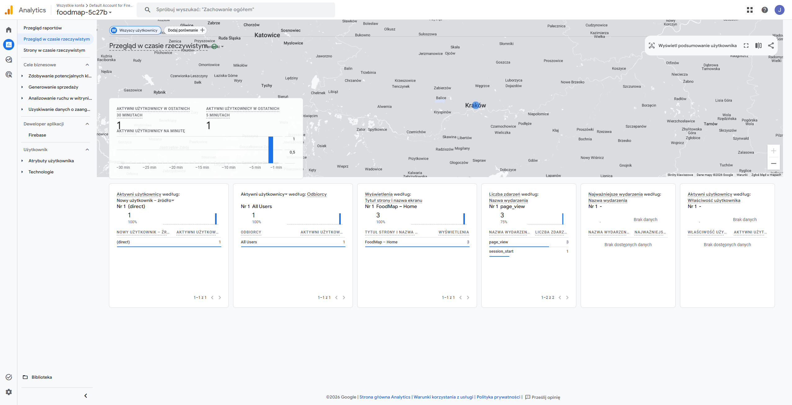
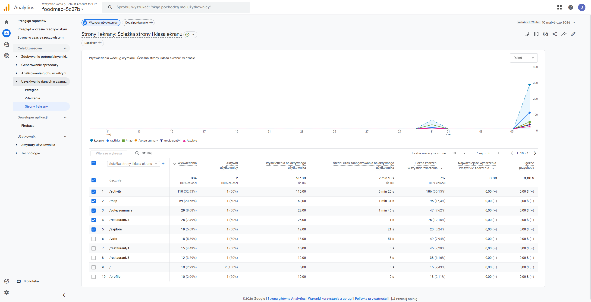
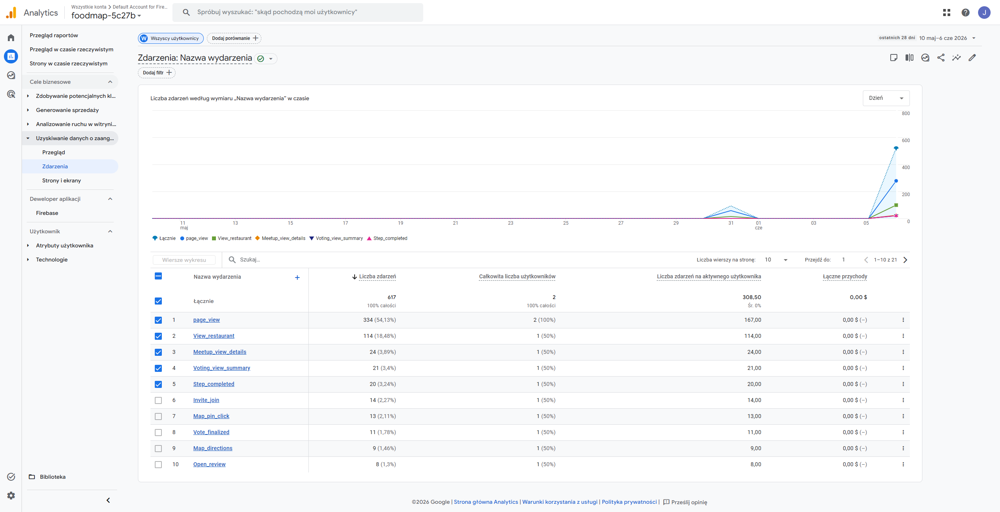
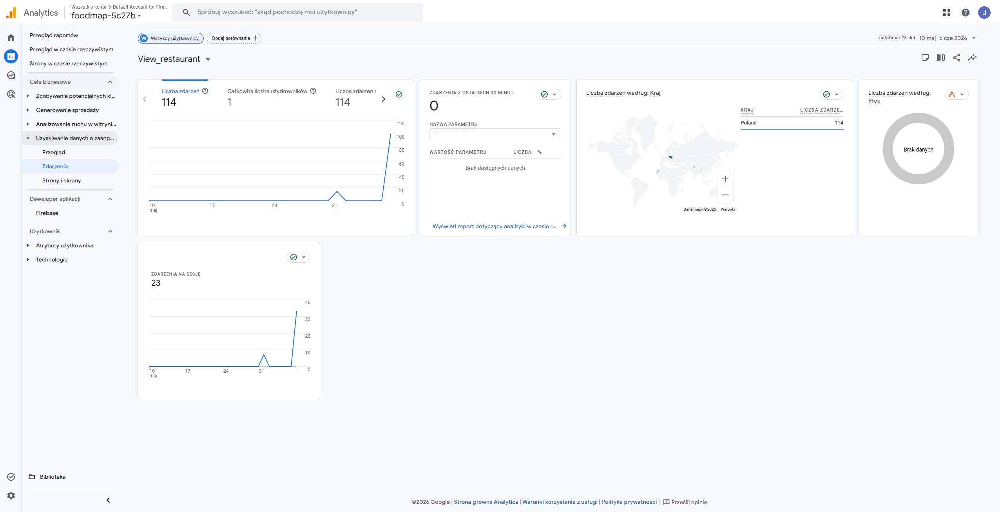
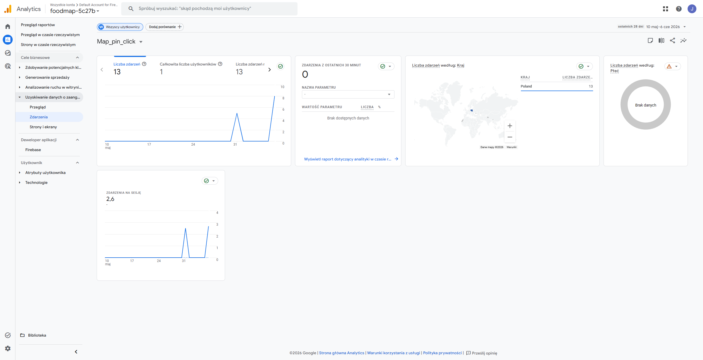

# FoodMap

Techniki Projektowania Frontendowego

## Design System: Gourmet Minimalist

The application follows the **Gourmet Minimalist** design philosophy, focusing on high-quality food photography and a clean, "breathable" interface.

### Features

- **Inter Font**: Systematic and highly readable typography.
- **Appetizing Palette**: A neutral base with primary orange accents (#8b5000) to evoke warmth and hunger.
- **Rounded UI**: Soft aesthetics with 0.5rem (standard) to 1.5rem (cards) border radii.
- **Tonal Layers**: Minimal shadows replaced by tonal separation and subtle outlines.

## Profile Management

A dedicated profile view for authenticated users to track their culinary journey.

### Features

- **Dynamic User Data**: Displays name retrieved directly from Firebase Authentication.
- **Personalized Content**: "Visited" and "Want to Visit" tabs for tracking food spots.

## Voting System (DineVote)

A multi-stage voting process to help groups decide on a venue and time.

### Features

- **3-Step Wizard**: Simplified flow from room creation to finalization.
- **Cravings-Based Voting**: Users select their preferred cuisine before voting for specific venues.
- **Availability Matching**: Interactive time-slot selection with group availability indicators.
- **Interactive UI**: Real-time feedback on vote counts and selection states.

## Component Architecture

- **DishCard**: A reusable card component prioritized for food photography and ratings.
- **Navbar**: Fixed bottom navigation for seamless multi-screen transitions.

## Authentication (Firebase)

The application uses Firebase Authentication for user management.

### Features

- User registration with Email/Password.
- User login with Email/Password.
- Profile management (Store `displayName` during registration).
- Persistent session handling via `onAuthStateChanged`.
- Protected routes for authenticated users.

### Configuration

<<<<<<< Updated upstream
To run the project locally with authentication, create a `.env` file in the `FoodMap-frontend/` directory based on `.env.example`:
=======
#TODO: Zrzut ekranu formularza logowania (`/login`) — pola e-mail/hasło, przyciski Login i Google.

#TODO: Zrzut ekranu formularza rejestracji (`/register`) — pola imię, e-mail, hasło, potwierdzenie hasła.

#### Mapa restauracji

#TODO: Zrzut ekranu mapy (`/map`) — piny restauracji na mapie Krakowa, pasek filtrów u góry, dolna nawigacja.

#TODO: Zrzut ekranu popupu pinu na mapie — nazwa lokalu, ocena, przycisk przejścia do szczegółów.

#### Explore, Activity, Profile

#TODO: Zrzut ekranu Explore (`/explore`) — lista kart użytkowników społeczności.

#TODO: Zrzut ekranu Activity (`/activity`) — feed z zaproszeniem do głosowania, spotkaniem i przypomnieniem o recenzji.

#TODO: Zrzut ekranu Profile (`/profile`) — avatar, statystyki, zakładka „Visited" z kartami dań.

#TODO: Zrzut ekranu Profile — zakładka „Want to Visit".

#### Restauracja i recenzje

#TODO: Zrzut ekranu szczegółów restauracji (`/restaurant/:id`) — nagłówek, lista dań, przycisk ulubionych.

#TODO: Zrzut ekranu formularza recenzji (`/restaurant/:id/review`) — ocena gwiazdkowa i pole komentarza.

#### DineVote (głosowanie grupowe)

#TODO: Zrzut ekranu DineVote — krok 1 (`/vote`) — tworzenie pokoju, zaproszenie znajomych.

#TODO: Zrzut ekranu DineVote — krok 2 — wybór kuchni i głosowanie na lokal.

#TODO: Zrzut ekranu DineVote — krok 3 — wybór daty i przedziału czasowego.

#TODO: Zrzut ekranu podsumowania głosowania (`/vote/summary`) — zwycięski lokal, godzina, CTA.

#### Profil innego użytkownika

#TODO: Zrzut ekranu profilu użytkownika (`/user/:id`) — publiczny profil z aktywnością.

---

### Google Analytics — screeny użycia

Zrzut ekranu panelu GA4 — widok **realtime** z aktywnymi użytkownikami podczas korzystania z aplikacji.



Zrzut ekranu GA4 — raport **strony i ekrany** z listą tras (/activity, /map, /vote/summary, itd.).



Zrzut ekranu GA4 — raport **zdarzenia** z zdarzeniami niestandardowymi.



Zrzut ekranu GA4 — przykładowe zdarzenie `view_restaurant`.



Zrzut ekranu GA4 — przykładowe zdarzenie `map_pin_click`.



---

### Hotjar — screeny użycia

#TODO: Zrzut ekranu panelu Hotjar/Contentsquare — lista **Session Recordings** z nagraniami sesji użytkowników FoodMap.

#TODO: Zrzut ekranu Hotjar — odtwarzacz nagrania sesji na ekranie mapy lub logowania.

#TODO: Zrzut ekranu Hotjar — **Heatmap** (kliknięcia lub ruch myszy) na wybranym ekranie aplikacji, np. Home lub Map.

#TODO: Zrzut ekranu Hotjar — dashboard potwierdzający aktywny tracking tag (ID skryptu z `VITE_HOTJAR_SCRIPT_ID`).

---

### Deploy

#TODO: Zrzut ekranu panelu hostingu (np. Railway, Vercel, Netlify) — status wdrożenia frontendu, URL produkcyjny, ostatni successful deploy.

#TODO: Zrzut ekranu aplikacji działającej pod publicznym adresem URL w przeglądarce.

---

## Stack technologiczny

### Frontend (`FoodMap-frontend/`)

| Technologia | Wersja / rola |
|-------------|---------------|
| React | 18 — UI |
| TypeScript | 6 — typowanie |
| Vite | 8 — bundler i dev server |
| React Router | 7 — routing SPA |
| Firebase | 12 — Authentication |
| react-ga4 | 3 — Google Analytics 4 |
| Leaflet + react-leaflet | mapa interaktywna |
| Axios | komunikacja z API backendu |
| Lucide React | ikony uzupełniające |

### Backend (`FoodMap-backend/`)

| Technologia | Rola |
|-------------|------|
| Node.js + Express | REST API (restauracje, użytkownicy) |
| Port domyślny | `3000` |

---

## Struktura repozytorium

```
FoodMap/
├── FoodMap-frontend/          # Aplikacja React (Vite)
│   ├── src/
│   │   ├── pages/             # Widoki pełnoekranowe (jeden folder = jeden ekran)
│   │   ├── components/        # Komponenty współdzielone UI
│   │   ├── context/           # AuthContext — stan sesji użytkownika
│   │   ├── config/            # Firebase, Analytics, Hotjar
│   │   ├── hooks/             # usePageTracking — GA pageview
│   │   ├── services/          # authService — Google Sign-In
│   │   ├── api/               # foodmapApi — klient REST
│   │   └── constants/         # trasy, kolory, typografia
│   ├── .env.example           # Szablon zmiennych środowiskowych
│   └── package.json
├── FoodMap-backend/           # API Express
│   ├── server.js
│   ├── restaurants.js
│   └── users.js
└── README.md                  # Niniejsza dokumentacja
```

---

## Ekrany i routing

Wszystkie ekrany z prototypu są zarejestrowane w React Router. Trasy publiczne są dostępne bez logowania; pozostałe chroni komponent `ProtectedRoute` w `App.tsx`.

| Trasa | Komponent | Dostęp | Opis |
|-------|-----------|--------|------|
| `/` | `Home` | publiczny | Landing page, CTA do mapy |
| `/login` | `Login` | publiczny | Logowanie e-mail / Google |
| `/register` | `Register` | publiczny | Rejestracja konta |
| `/map` | `Map` | chroniony | Interaktywna mapa restauracji |
| `/explore` | `Explore` | chroniony | Odkrywanie użytkowników |
| `/activity` | `Activity` | chroniony | Feed aktywności |
| `/profile` | `Profile` | chroniony | Własny profil użytkownika |
| `/vote` | `Vote` | chroniony | Kreator DineVote (3 kroki) |
| `/vote/summary` | `VotingSummary` | chroniony | Wynik głosowania |
| `/user/:id` | `UserProfile` | chroniony | Profil innego użytkownika |
| `/restaurant/:id` | `RestaurantDetails` | chroniony | Szczegóły lokalu |
| `/restaurant/:id/review` | `Review` | chroniony | Formularz recenzji |

Definicje tras: `FoodMap-frontend/src/constants/routes.ts`  
Konfiguracja routera: `FoodMap-frontend/src/App.tsx`

---

## Komponenty współdzielone

Powtarzające się elementy UI zostały wydzielone do reużywalnych komponentów z propsami:

| Komponent | Ścieżka | Zastosowanie |
|-----------|---------|--------------|
| `Button` | `components/common/Button/` | Przyciski primary, ghost, nav-link — warianty przez prop `variant` |
| `Input` | `components/common/Input/` | Pola formularzy (auth, mapa, vote) |
| `Label` | `components/common/Label/` | Etykiety pól formularza |
| `AuthCard` | `components/common/AuthCard/` | Ramka formularzy logowania i rejestracji |
| `DishCard` | `components/common/DishCard/` | Karta dania z fotografią, oceną i ceną |
| `RestaurantDishCard` | `components/restaurant/RestaurantDishCard/` | Wariant karty dania na stronie restauracji |
| `Navbar` | `components/common/Navbar/` | Dolna nawigacja: Map · Explore · Activity · Profile |

---

## System designu i stylowanie

Aplikacja implementuje design system **Gourmet Minimalist** (*Appetizing Minimalism*):

- **Paleta:** białe tło (#FFFFFF / #F9F9F9), akcent primary (#8B5000 / #FF9800), secondary (#FFC107), tekst (#212121).
- **Typografia:** font **Inter** — hierarchia przez rozmiar i wagę (`constants/typography.ts`).
- **Spacing:** siatka 8 px, duże marginesy między sekcjami.
- **Komponenty:** karty dań z dominującą fotografią (~60% powierzchni), zaokrąglenia `rounded-xl`, cienkie obramowania zamiast ciężkich cieni.
- **Metoda stylowania:** dedykowane pliki CSS per komponent/widok (bez mieszania frameworków).

Tokeny kolorów: `FoodMap-frontend/src/constants/colors.ts`

---

## Uruchomienie lokalne

### Wymagania

- Node.js (LTS)
- npm
- Konto Firebase z włączonym Email/Password (oraz opcjonalnie Google Sign-In)

### Frontend

```bash
npm --prefix FoodMap-frontend install
npm --prefix FoodMap-frontend run dev
```

Aplikacja domyślnie startuje pod adresem `http://localhost:5173`.

### Backend (opcjonalnie — dane restauracji z API)

```bash
npm --prefix FoodMap-backend install
npm --prefix FoodMap-backend run dev
```

API nasłuchuje na `http://localhost:3000`.

### Skrypty npm (frontend)

| Polecenie | Opis |
|-----------|------|
| `npm run dev` | Serwer deweloperski z HMR |
| `npm run build` | Build produkcyjny (`dist/`) |
| `npm run preview` | Podgląd buildu produkcyjnego |
| `npm run lint` | ESLint |

---

## Konfiguracja środowiska

Skopiuj szablon i uzupełnij wartości:

```bash
cp FoodMap-frontend/.env.example FoodMap-frontend/.env
```

Plik `FoodMap-frontend/.env`:
>>>>>>> Stashed changes

```env
VITE_FIREBASE_API_KEY=your_api_key
VITE_FIREBASE_AUTH_DOMAIN=your_project.firebaseapp.com
VITE_FIREBASE_PROJECT_ID=your_project_id
VITE_FIREBASE_STORAGE_BUCKET=your_project.appspot.com
VITE_FIREBASE_MESSAGING_SENDER_ID=your_sender_id
VITE_FIREBASE_APP_ID=your_app_id
```


## Google Analytics

The application integrates **Google Analytics** for user behavior analysis, using the `react-ga4` library wired into the SPA router.

### Configuration

To enable Google Analytics add the following evironmental variable to the `FoodMap-frontend/.env`:

```env
VITE_GOOGLE_ANALYTICS_MEASUREMENT_ID=G-XXXXXXXXXX
```

### What is collected

- **Page views** — every screen the user visits, tracked with a readable title (Home, Map, Restaurant Details, etc.) on each route change.
- **Authentication** — successful and failed logins and registrations (Email / Google), plus logout.
- **Map interactions** — dish searches, filter usage, restaurant pin clicks, and starting a group vote.
- **Restaurant engagement** — viewing a restaurant, marking favorites, and starting a review.
- **Reviews** — review submissions together with the selected rating.
- **Group voting** — progressing through the vote wizard and finalizing a vote.
- **Social & profile** — viewing other users' profiles and switching profile tabs.
- **Automatic GA4 signals** — sessions, first visits, scrolls, engagement time, and session metadata (device, browser, country, referral source).


### Implementation Details

- `AuthContext.tsx`: Provides the authentication state (`user`, `loading`) and `logout` function to the entire application.
- `firebase.ts`: Initializes the Firebase SDK using environment variables.
- `ProtectedRoute`: A wrapper component in `App.tsx` that redirects unauthorized users to the login page.
